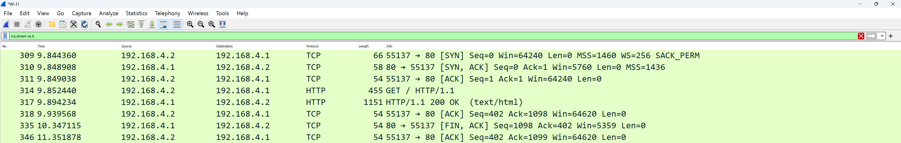
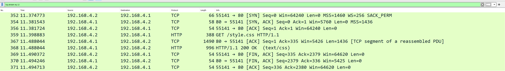
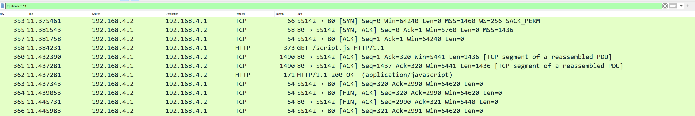

GET / HTTP/1.1
Host: avalink.local
Connection: keep-alive
Upgrade-Insecure-Requests: 1
User-Agent: Mozilla/5.0 (Windows NT 10.0; Win64; x64) AppleWebKit/537.36 (KHTML, like Gecko) Chrome/129.0.0.0 Safari/537.36
Accept: text/html,application/xhtml+xml,application/xml;q=0.9,image/avif,image/webp,image/apng,*/*;q=0.8
Sec-GPC: 1
Accept-Language: en-US,en;q=0.7
Accept-Encoding: gzip, deflate

HTTP/1.1 200 OK
Content-Disposition: inline
Last-Modified: Wed, 09 Oct 2024 13:44:36 GMT
Connection: close
Accept-Ranges: none
Content-Length: 917
Content-Type: text/html

<!DOCTYPE html>
<html>
<head>
    <PageTitle>Chat Sample</PageTitle>
    <link rel="stylesheet" href="style.css">
    
</head>
    <body onload="openWebSocket()">
        <h3>Public</h3>
        

            

                <!-- loop through messages list check if sent or received, timestamp for order and display -->
            

        

        

            

                <input type = "text" id = "messageInput"></input> 
                <button class="sendButton" onclick = "publicChatHandler.sendMessage()">Send</button>
            

            <button class="sosButton" onclick="showModal">SOS</button>
        

        <SosModal IsVisible="isVisible" HideModal="hideModal" />
    </body>
</html>

GET /style.css HTTP/1.1
Host: avalink.local
Connection: keep-alive
User-Agent: Mozilla/5.0 (Windows NT 10.0; Win64; x64) AppleWebKit/537.36 (KHTML, like Gecko) Chrome/129.0.0.0 Safari/537.36
Accept: text/css,*/*;q=0.1
Sec-GPC: 1
Accept-Language: en-US,en;q=0.7
Referer: http://avalink.local/
Accept-Encoding: gzip, deflate

HTTP/1.1 200 OK
Content-Disposition: inline
Last-Modified: Mon, 07 Oct 2024 14:56:38 GMT
Connection: close
Accept-Ranges: none
Content-Length: 2198
Content-Type: text/css

/* Chat Styling */
.modal {
  display: none;
  position: fixed;
  z-index: 1;
  left: 0;
  top: 0;
  width: 100%; /* Adjusted for full screen */
  height: 100%; /* Adjusted for full screen */
  overflow: auto;
  background-color: rgba(0,0,0,0.4);
}

.modal-content {
  background-color: #fefefe;
  margin: 15% auto;
  padding: 20px;
  border: 1px solid #888;
  width: 90%; /* Adjusted to fit smaller screens */
}

.close {
  color: #aaa;
  float: right;
  font-size: 28px;
  font-weight: bold;
}

.chatContainer {
    width: 100%; 
    max-width: 90vw; 
    height: 60vh; /* Adjusted to fit dynamically */
    margin: 0 auto; 
    overflow-y: auto; 
    border: 1px solid #b4b2b2; 
    padding: 10px; 
    box-sizing: border-box; 
    background-color: #f9f9f9; 
    display: flex;
    flex-direction: column; 
    gap: 10px; 
    border-radius: 5px;
}

.message {
    padding: 10px 15px;
    border-radius: 15px;
    max-width: 70%;
    word-wrap: break-word;
}

.message.received {
    background-color: #0084ff;
    color:white;
    align-self: flex-start;
}

.message.sent {
    background-color: #28a745;
    color: white;
    align-self: flex-end;
}

.inputContainer {
    display: flex;
    justify-content: center;
    max-width: 90vw;
    margin: 10px auto 0;
    background-color: #D3D3D3;
    padding: 10px;
    border-radius: 5px;
    border: 1px solid #b4b2b2;
    flex-direction: column; /* Make everything stack vertically */
    gap: 10px; /* Add spacing between sections */
}

.inputSection {
    display: flex;
    gap: 10px;
    align-items: center; /* Align button with the input field */
}

input {
    flex: 1;
    padding: 10px;
    font-size: 16px;
    width: 100%;
}

.sendButton {
    padding: 10px 20px;
    font-size: 16px;
    background-color: #28a745;
    color: white;
    border: none;
    border-radius: 5px;
    cursor: pointer;
}

.sosButton {
    padding: 10px 20px;
    font-size: 16px;
    background-color: #e65e38;
    color: white;
    border: none;
    border-radius: 5px;
    cursor: pointer;
    width: 100%; /* Make SOS button full width */
}

GET /script.js HTTP/1.1
Host: avalink.local
Connection: keep-alive
User-Agent: Mozilla/5.0 (Windows NT 10.0; Win64; x64) AppleWebKit/537.36 (KHTML, like Gecko) Chrome/129.0.0.0 Safari/537.36
Accept: */*
Sec-GPC: 1
Accept-Language: en-US,en;q=0.7
Referer: http://avalink.local/
Accept-Encoding: gzip, deflate

HTTP/1.1 200 OK
Content-Disposition: inline
Last-Modified: Wed, 09 Oct 2024 13:44:36 GMT
Connection: close
Accept-Ranges: none
Content-Length: 2795
Content-Type: application/javascript

class Message {
    constructor(content) {
        this.messageContent = content;
        //this.timestamp = new Date().toISOString();
        this.sent = 0;
        this.serverAck = 0;
    }
}

class ChatHandler {
    constructor() {
        this.messageHistory = [];  
    }

    sendMessage() {
        const inputElement = document.getElementById("messageInput");
        const messageContent = inputElement.value; 
        const trimmedContent = messageContent.trim();
    
        // Check if the message content is not empty
        if (trimmedContent !== "") {
            const newMessage = new Message(messageContent);  
            newMessage.sent = 1;
            newMessage.serverAck = 0;
            inputElement.value = "";    
            console.log(newMessage); 
            this.sendMessageToServer(newMessage); 
        }
    }

    receiveMessage(event) {
        const messageObject = JSON.parse(event.data);
        this.messageHistory.push(messageObject); 
        
        // Sort messages by timestamp
        this.messageHistory.sort((a, b) => new Date(a.timestamp) - new Date(b.timestamp));
        
        this.updateChatContainer(messageObject); 
    }

    updateChatContainer(message) { 
        const chatContainer = document.getElementById("chatContainer");
        const newMessageElement = document.createElement("div");
        newMessageElement.className = "message";
        newMessageElement.innerText = message.messageContent;
        chatContainer.appendChild(newMessageElement);
        chatContainer.scrollTop = chatContainer.scrollHeight;  // Scroll to the bottom
    }
    
    sendMessageToServer(messageObject) {
        if (socket && socket.readyState === WebSocket.OPEN) { // Ensure the socket is open
            // Convert the Message object to JSON and send it
            socket.send(JSON.stringify(messageObject)); 
            console.log('Message sent:', messageObject); // Log the sent message for debugging
        } else {
            console.log('WebSocket is not connected. Message not sent.');
        }
    }
}

// Globals
const publicChatHandler = new ChatHandler();  
let socket;

function openWebSocket() {
    socket = new WebSocket('ws://localhost:8080');  // change to DNS URL once setup
    socket.onopen = function(event) {
        console.log('WebSocket is connected.');
    };
    socket.onmessage = function(event) {
        let message = event.data;
        publicChatHandler.receiveMessage();
    };
    socket.onclose = function(event) {
        console.log('WebSocket is closed.');
    };
    socket.onerror = function(error) {
        console.log('WebSocket error: ' + error.message);
    };
}

